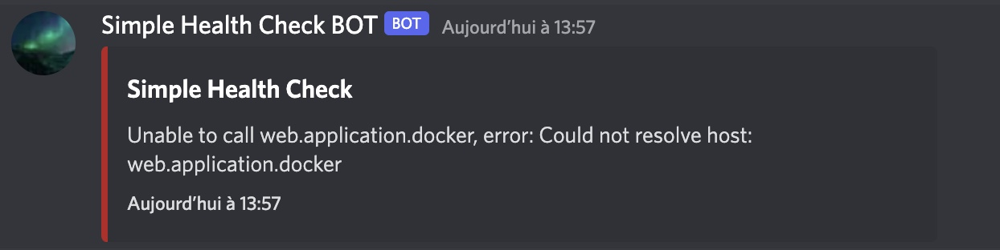

# Simple-health-check-monitoring :bulb: 

## Simple script that ping a web application and send a slack notification if there is a server error.


---

## You can use the PHP script or the Bash script.

## Requirements

- PHP >= 7.1
- Bash is available.

### PHP

Edit the `config.php.dist` with your parameters

```cp config.php.dist config.php```

Run script (can be run with an interval via a CRON)

```php path/to/directory/check_and_notif.php > /dev/null```

---
### Bash

Edit the `config.sh.dist` with your parameters

Run script (can be run with an interval via a CRON)

```bash path/to/directory/check_and_notif.sh > /dev/null```

## Urls

### Slack

See [slack documentation](https://api.slack.com/messaging/sending)

### Discord

You must create a webhook on the channel of your choice.
You must have the rights on the Discord server for this.


## Results

### Discord

- with PHP : 


- with Bash :


